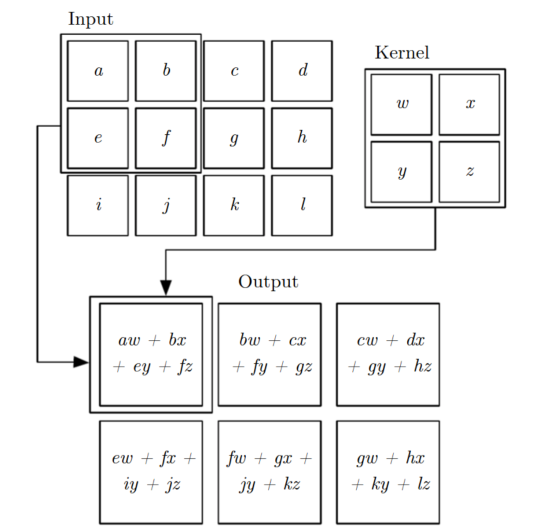
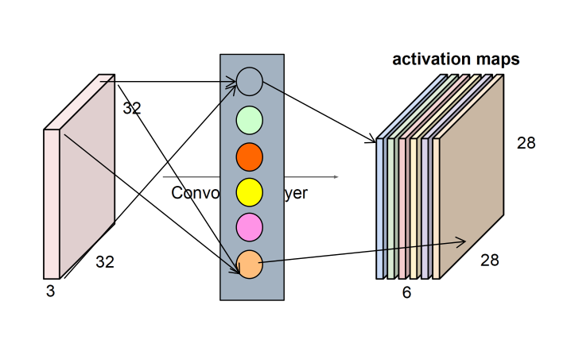
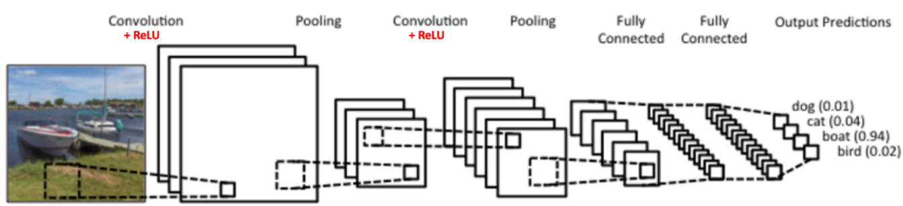

---
### 
引言

&emsp; 在这一段时间里面，我在有关深度学习的知识上面取得了一定的进步。从第一次去和张新良老师交流，到现在我着手开始写这个总结，我从基本的卷积神经网络出发，先使用基本的卷积神经网络对精确的单张人脸进行识别，再在多个人脸共存的环境中对人脸进行检测，实现了多张人脸同步识别。再从物体检测识别的方向出发，对于工业应用场景里面的物体进行检测识别并定位，再将这些数据传给程序控制的机械手臂，达到工业场景下的智能分拣的效果。
### 
主要内容

#### 1.基本CNN进行人脸识别的学习应用
##### 1.1传统机器学习
&emsp;在基本的机器学习的做法中，我们往往是使用一些人工给定的特征来进行算法学习，就二分类问题下的逻辑回归来说，我们使用现有的特征去形成一个可知的模型，然后利用均方误差、平均绝对值等构成模型的损失函数，损失函数对于参数求偏导之后便可以对于参数进行凸优化进行机器学习训练，最后形成一个可用的模型，具体做法可见我的博客[逻辑回归算法浅析及其Python实现](https://blog.csdn.net/qq_36782182/article/details/85009739)，此类机器学习的方法也被应用在了大量的现实问题处理中。但是传统的机器学习算法在图像识别等复杂工作上面却无法表现的更好。
&emsp;在2012年的卷积神经网络算法AlexNet以大幅度领先超越传统机器学习算法获得ImageNet竞赛冠军之后，卷积神经网络在图像问题上面的可行性就被广泛认知了。
##### 1.2卷积神经网络
&emsp;对于一张256\*256的图像来说，它上面的像素点就是256×256个，可以形成一个256×256的矩阵：
$$\begin{bmatrix}
x_1^1&x_2^1&{\cdots}&x_{256}^1\\
x_1^2&x_2^2&{\cdots}&x_1^2\\
{\vdots}&{\vdots}&{\ddots}&{\vdots}\\
x_1^{256}&x_1^2&{\cdots}&x_{256}^{256}\\
\end{bmatrix}=X_1$$
&emsp;另外，为了从图像里面提取特征，我们需要对于这个矩阵的一些卷积核，如果我们拥有一个大小为3×3的卷积核的话：
$$\begin{bmatrix}
\theta_1^1&\theta_2^1&\theta_3^1\\
\theta_1^2&\theta_2^2&\theta_3^2\\
\theta_1^3&\theta_2^3&\theta_3^3\\
\end{bmatrix}=\Theta_1$$

&emsp;那么我们使用这个卷积核对$X$矩阵的子矩阵$x_1^1\sim{}x_3^3$进行卷积运算，便可以得到基于这个卷积核的一个特征值，同时我们还可以拥有多个$\Theta$,在我们用卷积核对原始图像进行卷积时，我们可以先对左上角进行卷积、再向右移动一格，再次进行卷积，在第一层卷积之后，我们再将卷积核往下移动一格，按照第一层的方式再进行卷积，在用单一3×3卷积核对一张256×256的图像进行卷积之后，我们可以得到一个253×253的特征矩阵，如果我们有n个卷积核的话，那么我们就会有n个特征矩阵，再将这些特征矩阵中的特征值输入到一个全连接层，也就是：
$$f(x)=\sum_{i=1}^{n*256*256}\omega_{i}x_i + b$$

<i>这里的x指的原始图像经过随机排列的全部特征值,$\omega$指的是全连接网络的权值</i>

  

&emsp;而我们不止可以只使用一层卷积层，也就是不止使用卷积核对最基本的像素元素进行卷积，我们还可以使用卷积核对第一层卷积提取到的特征进行卷积操作，以提取更高维的特征。所以我们现在的操作就变成了多层卷积，当卷积层变得越来越多的时候，这网络就会变得很深，也就是深度卷积网络。深度学习也就是由此而来。
&emsp;当然，一次又一次的卷积操作，只能给我们的系统带来线性变化，而我们需要一个非线性的系统来形成性能优越的模型，在这里，我们引入激活函数这个概念，激活函数的输入可以是每一次卷积操作的结果，输出位置和没有经过激活函数的卷积输出相同，为了使得我们的系统获得非线性的表现，我们的激活函数需要是非线性的，经过前人的模型实践，Relu激活函数可以达到较好的效果，其中Relu的函数模型为：

$$f(x)=\begin{cases}
x,&x>0\\
0,&x<=0
\end{cases}$$
&emsp;在经过不断的卷积之后，由于卷积核有很多等因素，会出现维度爆炸等问题，导致权值过多，以致于无法进行计算，为了降低权值数量，我们可以使用池化操作对特征进行降维。池化操作就是将一部分相邻的特征值用一些规则，比如取最大值，在多个特征值中进行操作之后最后只剩下一个特征值的操作，这种方法可以使模型特征数量大大减少。
&emsp;当我们的模型融合了卷积、池化、激活函数、全连接层这些元素之后，一个基本的卷积神经网络就OK了，如图所示：

&emsp;在后续的实践中，我是用了轻量的400张人脸图片对于卷积神经网络模型进行了验证，并取得了不错的效果。
&emsp;我使用的数据集是下面这些人脸：
  
&emsp;我将这些人脸数据的每一类分为两份，一半用来训练，一半用来测试，最终得到的正确识别率为98%，虽然数据量较小，但是也可以在一定程度上验证卷积神经网络模型的可行性。

#### 2.人脸检测与识别
##### 2.1.探索与选择
&emsp;在进行对于多张人脸同步识别这个问题的探索与解决的时候，我的想法是先将图片里面的人脸与背景分离出来，至少要先将人脸在整体图像中框定出来，再用人脸识别模型对框定出来的图像进行人脸识别，具体实现采用了MTCNN模型。
##### 2.2.MTCNN模型
###### 2.2.1.MTCNN的主要模型架构
&emsp;*MTCNN*，Multi-task convolutional neural network（多任务卷积神经网络），将人脸区域检测与人脸关键点检测放在了一起，基于cascade框架。总体可分为PNet、RNet、和ONet三层网络结构。
&emsp;总的来说，这个模型就是利用了三个不同的CNN模型对于原始输入进行处理，并最终输出可信度较高的人脸检测框。
###### 2.2.2.MTCNN的实现
&emsp;首先，我们在现实生活中，拍摄到的人脸在整张图片里面有大有小，为了使我们的不同大小的人脸都可以被检测出来，我们可以对图片进行缩放，并将不同缩放大小的图片输入到检测网络中，以期达到不同大小的人脸都可以成功检测的效果。在这种操作之后可以想象一下把最大的图片放在最下面，尺度最小的放在最上面，依次排列，像一个金字塔一样，这就是我们常说的图像金字塔。
&emsp;三层网络模型的实现：
* P-Net
全称为Proposal Network，其基本的构造是一个全连接卷积神经网络。对上一步构建完成的图像金字塔，通过一个FCN进行初步特征提取与标定边框，并进行Bounding-Box Regression调整窗口与NMS进行大部分窗口的过滤。
