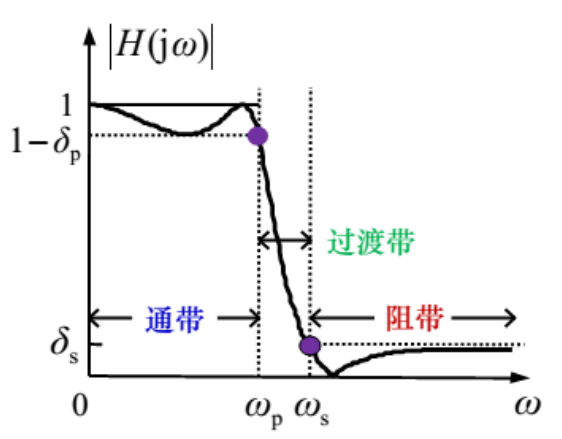
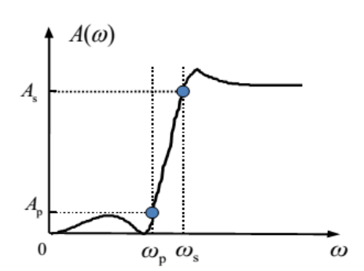

# 数组信号处理-4

---

### [IIR（Inifine Impulse Response）]('无限冲激响应')数字滤波器的设计
#### 数字滤波器的技术要求
* $\Omega_p$：通带截止频率
* $\Omega_s$：阻带截止频率
* $\delta_p$：通带波动
* $\delta_s$：阻带波动

#### 数字滤波器的设计目标
&emsp;由给定的数字滤波器频率特性的指标，确定M、N及系数$a_i、b_j$，从而得到数字滤波器的系统函数$H(z)$，例如：
$$H(z)=\frac{1+2z^{-1}+3z^{-3}}{1-0.5z^{-1}}$$
&emsp;其中$b_0=1,b_1=2,b_2=0,b_3=3,a_1=0.5,M=3,N=1$。

#### IIR数字滤波器的设计步骤
1. 将数字滤波器设计转换为模拟滤波器的设计
2. 设计满足指标的模拟滤波器
3. 将模拟滤波器转换为数字滤波器

$$\Omega_p,\Omega_s\xrightarrow[\mbox{变换}]{\mbox{频率}}\omega_p,\omega_s\xrightarrow[\mbox{滤波器}]{\mbox{设计模拟}}H(s)\xrightarrow[\mbox{双线性变换法}]{\mbox{脉冲响应不变法}}H(z)$$
$$
\omega_p、\omega_s\xrightarrow[\mbox{变换}]{\mbox{频率}}\bar{\omega}_p、\bar{\omega}_s\xrightarrow[\mbox{低通滤波器}]{\mbox{设计原型}}H_l(\bar{s})\xrightarrow[\mbox{变换}]{\mbox{复频域}}H(s)
$$
&emsp;**BW、CB、C三个低通滤波器模板**

#### 模拟低通滤波器的设计
##### 模拟低通滤波器的技术指标要求
* $\omega_p$：通带截止频率
* $\omega_s$：阻带截止频率
* $\delta_p$：通带波动
* $\delta_s$：阻带波动

* 衰减函数(dB)：$A(\omega)=-10lg{|H(j\omega)|}^2=-20lg|H(j\omega)|$
 
* 通带最大衰减：$A_p=-10log{(1-\delta_p)}^2=-20lg(1-\delta_p)$
* 阻带最小衰减：$A_s=-10log{(\delta_s)}^2=-20lg(\delta_s)$
* 增益函数：$G(\omega)=-A(\omega)$

##### ButterWorth模拟低通滤波器
###### BW模拟低通滤波器的频域特性
$${|H(j\omega)|^2}=\frac{1}{1+({\omega}/{\omega_c})^{2N}}$$
* N：滤波器阶数
* $\omega_c$：3dB截频

1. $|H(j0)|=1,H(j\infty)=0,A(\omega)=-10lg|H(j\omega_c)|^2\approx{3dB}(3dB截频)。若\omega_c=1,则为归一化的BWF$
2. 幅度响应单调下降
3. $|H(j\omega)|^2$在$\omega=0$点1到2N-1阶导数为零，称为最大平坦性
