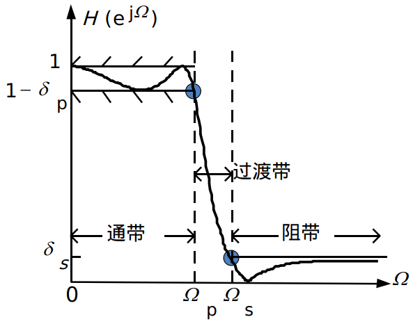

# 数组信号处理-4

---

### [IIR（Inifine Impulse Response）]('无限冲激响应')数字滤波器的设计
#### 数字滤波器的技术要求
* $\Omega_p$：通带截止频率
* $\Omega_s$：阻带截止频率
* $\delta_p$：通带波动
* $\delta_s$：阻带波动

#### 数字滤波器的设计目标
&emsp;由给定的数字滤波器频率特性的指标，确定M、N及系数$a_i、b_j$，从而得到数字滤波器的系统函数$H(z)$，例如：
$$H(z)=\frac{1+2z^{-1}+3z^{-3}}{1-0.5z^{-1}}$$
&emsp;其中$b_0=1,b_1=2,b_2=0,b_3=3,a_1=0.5,M=3,N=1$。

#### IIR数字滤波器的设计步骤
1. 将数字滤波器设计转换为模拟滤波器的设计
2. 设计满足指标的模拟滤波器
3. 将模拟滤波器转换为数字滤波器
$$\Omega_p,\Omega_s\stackrel{频率变换}{\Longrightarrow}1$$