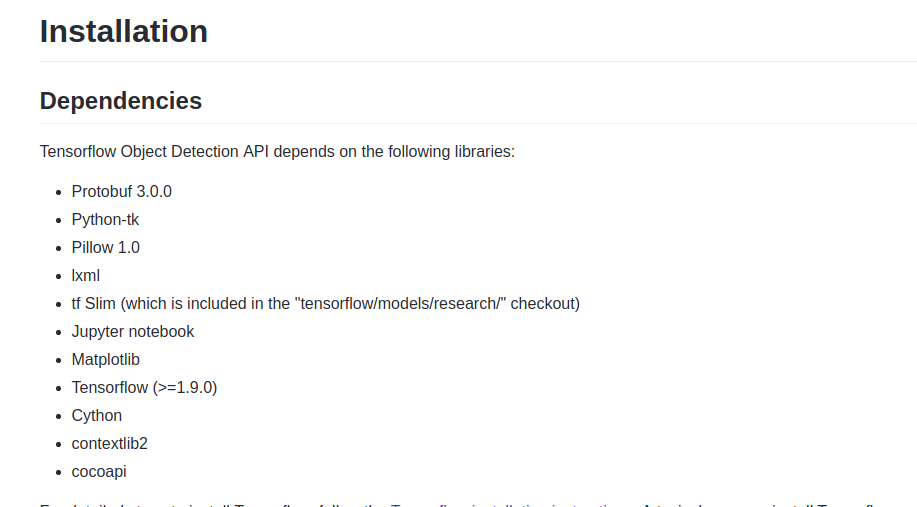

# TensorFlow使用object detection训练自己的模型用于物体识别

##### 简介
> 使用tensorflow的[object_detection](https://blog.csdn.net/gbbb1234/article/details/78480896)模块进行物体检测训练，最终实现识别自己的数据集


 ##### 机器配置与工作环境：
> * 硬件：
>   * cpu：i56300hq
>   * gpu：gtx960m\*2g
> * 软件
>   * ubuntu18.04
>   * python3.6
>   * tensorflow\*1.14.0
>   * 其他需要的扩展包按照[官方文档](https://github.com/tensorflow/models/blob/master/research/object_detection/g3doc/installation.md)安装完成即可
>   
 ##### 训练数据准备
> object_detection推荐的训练数据格式是TFRecord格式的文件，我们需要通过对图片进行标注生成xml文件、将xml文件生成csv文件，再将csv文件转换为TFRecord文件以生成训练数据。
> 1. 使用labelImg工具标注图片生成xml文件：
>  在[这里](https://github.com/tzutalin/labelImg)下载并安装labelImg，官方教程很详细。安装之后使用此工具可以很容易对图片进行标注
> 2. 使用[Python脚本](https://github.com/Reqin/data_tools)转换xml数据为对应的csv数据
> 3. 使用[Python脚本](https://github.com/Reqin/data_tools)根据csv数据信息生成TFRecord数据
> 4. 在进行上述操作时候，我们还需要构建我们的标签图,后缀名为pbtxt,如：
>     ```Python
>     item{
>    	 id:1
>    	 name: 'dog'
>        }
>	  item{
>   	 id:2
>    	 name: 'cat'
>        }
>	  item{
>        id:3
>        name: 'else'
>	     }  
>      ```
 ##### 准备预训练模型
> 在[这里](https://github.com/tensorflow/models/blob/master/research/object_detection/g3doc/detection_model_zoo.md)下载一个预训练模型，解压之后得到一个模型文件目录，**注意，由于后续代码文件更新，所以需要将模型目录里面的.config文件由object_detection目录下的samples目录中对应的模型配置文件替换**，在替换之后，还需要根据自己的文件目录配置修改.config文件中的PATH_TO_BE_CONFIGURED字段：
> * num_classes：你自己训练的模型分类类别数量
> * fine_tune_checkpoint：解压后的模型文件中的*model.ckpt*文件路径
> * train_input_reader、eval_input_reader下的input_path和label_map_path：对应的训练数据集、验证数据集的.TFRecord输入输入和.pbtxt标签图文件
> * 注意：我在使用ssd模型的时候发生了错误，未找到正确的解决方法，建议使用faster_rcnn系列模型

##### 进行训练
> 注意，由于近期的代码更新，位于object_detection文件train.py移动到了legacy文件夹下，我们需要使用这个文件进行模型训练。


